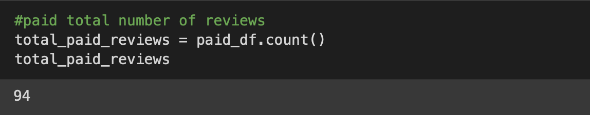
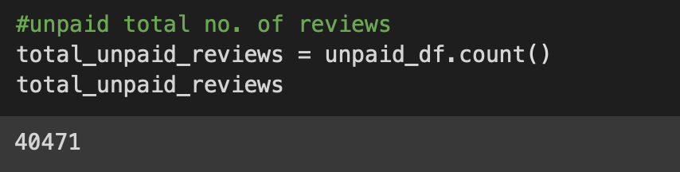
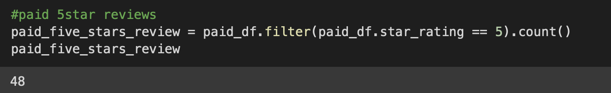
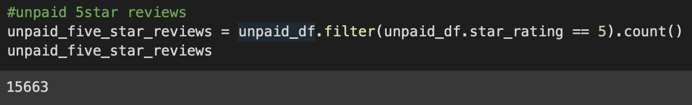
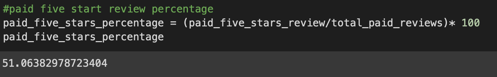
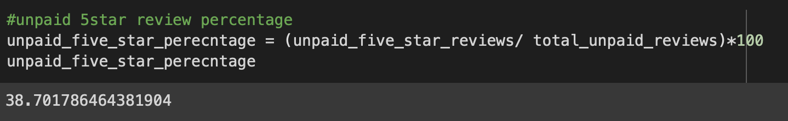

# Amazon_Vine_Analysis

## Overview
---
The Amazon Vine program is a service that allows manufacturers and publishers to receive reviews for their products. Companies like SellBy pay a small fee to Amazon and provide products to Amazon Vine members, who are then required to publish a review.
 - This project analyse and determines if there is any bias toward favorable reviews from Vine members
 - The analyses uses PySpark to perform the ETL process to extract the dataset, transform the data, connect to AWS RDS, load the data into pgAdmin
 - The dataset chosen for the analysis is `Video Games`

## Results
---
#### Total Paid Review:
`Vine Reviews`

#### Total Unpaid Review:
`Non-Vine Reviews`

#### Paid Five Star Reviews:
`Vine Reviews`

#### Unpaid Five Star Reviews:
`Non-Vine Reviews`

#### Paid Five Star Percentage:
`Vine Reviews`

#### Unpaid Five Star Percentage:
`Non-Vine Reviews`

## Summary
---
- Percentage of `Paid Five Star Vine` reviews is 51% whereas `Non-Vine` review is 39%
This describes positivity bias for reviews in the Vine program 
- We could also do some statistical analysis for Vine and Non-Vine reviews